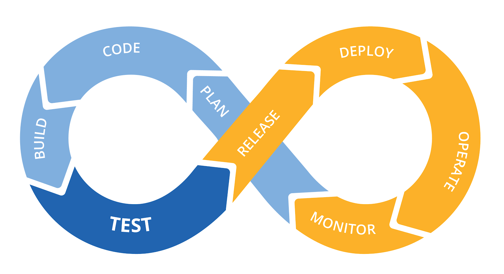

# What is continuous integration?

Continuous Integration (CI) is a development methodology where developers integrate code into a version control system, several times a day. Each integration is then checked with an automated build and automated tests.

## Why should a company use of CI?
*  Errors can be detected/located quickly.This is possible because with CI changes to code are small and push very fast. Therefore if a piece of code was introduced by mistake or breaks the overall project, it can be traced back much faster.

* Because the code is introduced in bite sized pieces, tests reliability improves. This allows more accurate results and code reviews. This is why test reliability within CI/CD can also be considered Continuous Reliability.

* Fault isolations are faster to detect and easier to implement. Fault isolation refers to designing systems such that negative impact of fatal/benign errors can be limited to pre-defined scope.

* Another advantage of introducing small code changes with CI is that the Mean Time To Resolution (MTTR) is reduced fault isolations are easier to detect.MTTR measures the maintainability of repairable features and sets the average time to repair a broken feature.

* CI allows for faster application releases because failures are detected sooner.
  
* CI is excellent in providing more transparency and accountability regardless of the size of the team. 
  
* Coupled with automation, CI reduces the number errors that can happen with repetitive tasks.

*  In recent years CI has become a best practice for software development and is guided by a set of key principles. Among them are revision control, build automation and automated testing.

  
## Sources
* https://codeship.com/continuous-integration-essentials#:~:text=Continuous%20Integration%20(CI)%20is%20a,CI%20it%20is%20typically%20implied.
  
* https://www.katalon.com/resources-center/blog/benefits-continuous-integration-delivery/